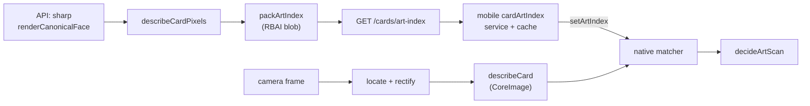

# iOS card scanning: implementation and model research

Reviewed 17 September 2026.

## Current pipeline

The scanner identifies a card by its picture. Nothing printed on the card is read: no title, no rules text, no collector code. Reading the ~12px collector footer needed accurate-level OCR over a 1200px rectification and a steadier hand than anyone scanning a stack of cards has; comparing pictures costs a fraction of that and tolerates tilt, glare and dim light far better.

One camera frame goes through three stages, all on the frame's own pixel buffer, on a native serial worker so frame delivery never waits:

1. **Locate** — Apple Vision finds a card-shaped rectangle inside the on-screen guide and the pipeline rectifies it to a 400px canonical face. Failing that, the guide crop is described as-is, which still works when the card fills the guide.
2. **Describe** — the rectified face is reduced to a descriptor (below).
3. **Search** — the descriptor is compared against the packed reference index with `vDSP_mmul`, and the top five candidates are re-ranked by Hamming distance over their gradient bits.

The frame output requests 720p. The descriptor is computed at 160×224, so a larger buffer only costs conversion time.

## The descriptor

Defined once in `packages/contracts/src/card-art.ts` and mirrored in `apps/mobile/modules/card-ocr-frame/ios/CardDescriptor.swift`. It is deliberately plain arithmetic rather than a learned embedding, because it has to be computed in two runtimes that must agree to the last bit: sharp on the server, CoreImage on the device.

1. Trim `ART_TRIM_INSET` (3%) from each edge at full resolution, absorbing the black border and any background that survives rectification.
2. Resize to 160×224, Lanczos3, aspect ignored.
3. Sum R, G and B over each cell of a 10×14 grid.
4. **Grey-world balance**: divide each channel by its own mean over the card. This must happen before the channels are mixed — the opponent channels below are differences, and no later centring or scaling of a difference can undo an illuminant that scaled its two terms unequally.
5. Convert to `L = .299R + .587G + .114B`, `A = R − G`, `B = (R+G)/2 − Blue`.
6. Standardize each channel to zero mean and unit deviation; this is what makes exposure stop mattering.
7. Emit 256 gradient-sign bits (32 bytes) from the L grid, one per adjacent block pair.
8. L2-normalize, then quantize to int8 with the largest component pinned to 127.

Cross-runtime hazards that are pinned down rather than hoped about: no linear-light conversion anywhere (sharp resizes gamma-encoded, so the native side uses a `faceContext` with `workingColorSpace: NSNull()`); `floor(v + 0.5)` on both sides, because Swift rounds halves away from zero and JavaScript rounds them up; an explicit top-down `CGContext` draw so row order cannot differ.

`ART_DESCRIPTOR_VERSION` travels in the index header. A device whose binary computes a different version refuses the index outright rather than comparing incomparable vectors.

### Measured separation

Against real CDN card art, a card degraded (blur, exposure, coloured illuminant, framing error) against its own reference scores **cos 0.983–0.998, hamming 2–14**, with a **0.58–0.81** gap to the runner-up. Different cards score **cos −0.15–0.40, hamming 109–136**. The thresholds in `card-scan.ts` (`ART_SCORE_FLOOR` 0.82, `ART_SCORE_MARGIN` 0.04, `ART_HAMMING_CEILING` 72) sit inside that gap. They are a starting point chosen from synthetic degradations of real art, not a measurement on physical cards — see tuning below.

## The index

`packArtIndex` produces one flat blob: `"RBAI"` magic, u16 version, u16 dimension, u16 bit width, u16 reserved, u32 count; then per record a u8 key length, the ASCII object key, `int8[dimension]`, and the gradient bytes. About 454 bytes per distinct picture, so the whole catalog is a one-second download rather than the ~25MB of card art an on-device index would have needed.

- **API.** `card_art_fingerprints` stores one row per image key. `CardArtIndexService` backfills in bounded runs (200 images, four fetches at a time) on both `syncCatalog` exit paths, renders each image through `renderCanonicalFace`, and caches the packed payload. `GET /api/v1/cards/art-index` serves it as `application/octet-stream` with a strong ETag, `x-art-descriptor-version` and `x-art-index-count`.
- **Client.** `services/cardArtIndex.ts` compares `artIndexHash` from the catalog meta against what is installed, reads the cached blob from `Paths.cache` when the hash matches, otherwise downloads, caches, and hands the buffer to `setArtIndex`. The scanner is inert until this succeeds; the guide overlay says so.

## Deciding

`decideArtScan` (contracts) turns one frame's ranked matches into a decision, statelessly. Because the index holds one entry per distinct picture, a runner-up under a different key really is a different picture, so the margin compares like with like.

A picture cannot separate reprints: one artwork is printed across several sets under different collector numbers, and those printings are pixel identical. When the winning key covers more than one printing, the decision is `hold` and the user picks. `lib/scan-stability.ts` adds the patience — two agreeing frames for a single printing, three for a shared artwork, within a 400ms gap and a 1.5s window, tolerating one missed read. The confirm modal still blocks, and yes still adds one normal copy and keeps the camera open.

## Tests

- `packages/contracts/src/card-art.test.ts` — descriptor behaviour under exposure drift, coloured illuminant, defocus and framing error, plus pack/parse round trips.
- `apps/api/test/unit/card-art-index.test.ts` — the same over real sharp-encoded images.
- `apps/api/test/e2e/card-art-index.test.ts` — endpoint shape, 304 revalidation, and that the filters meta hash equals the ETag.
- `apps/mobile/modules/card-ocr-frame/test/DescriptorParityTests.swift` — the parity gate. The macOS workflow builds contracts, runs `apps/api/scripts/write-art-parity-fixture.ts` to generate a reference card, a decoy, a golden descriptor and a packed index from the API's own TypeScript, then compiles the Swift descriptor and matcher against them. If the two runtimes ever drift, this fails before a build ships.

None of these establish physical-camera accuracy. They establish that both sides compute the same thing and that the format survives a round trip.

## Tuning on real cards

Dev builds print `locate+describe+search ms · top score` under the guide. The budget is under 15ms per pass end to end. To re-tune:

1. Scan a spread of cards — full art, visually similar pairs, shared-art printings, sleeved, tilted, under warm and dim light — and watch the printed score for correct and incorrect leads.
2. Raise `ART_SCORE_FLOOR` if wrong cards are offered; lower it if correct cards never clear it. Widen `ART_SCORE_MARGIN` if the scanner flickers between two similar cards.
3. `ART_HAMMING_CEILING` is the veto on a lucky cosine; tighten it before loosening the floor.

A wrong card added silently is worse than a card that takes another moment, so prefer abstaining.

## Replacing the descriptor later

The index format and the endpoint do not care what produced the vectors. A learned Core ML encoder can be swapped in by bumping `ART_DESCRIPTOR_VERSION`, changing both implementations, and letting the version mismatch invalidate every cached index automatically. The candidates considered:

| Option                              | Fit for this app                                                                                                                                                                              | Decision                                                                                       |
| ----------------------------------- | --------------------------------------------------------------------------------------------------------------------------------------------------------------------------------------------- | ---------------------------------------------------------------------------------------------- |
| Apple Vision feature prints         | Already on device, but the vectors are specific to the OS revision that produced them, so the server cannot precompute a reference index.                                                     | Rejected: it forced an on-device art download and embedding job.                               |
| Hand-specified descriptor (current) | Computable identically on server and device, tiny index, no model download, no training data.                                                                                                 | Shipped.                                                                                       |
| Create ML / Core ML card classifier | A card-specific model can learn our camera conditions, but needs representative labeled photos and retraining for new classes.                                                                | A reasonable experiment once real scans exist.                                                 |
| MobileCLIP / MobileCLIP2            | Mobile-oriented image encoders are technically relevant, but the published model license restricts use to noncommercial research and explicitly excludes product development.                 | Do not ship or integrate these weights under that license.                                     |
| SigLIP 2 Base                       | Google's model card provides image embeddings and lists Apache-2.0 licensing. This is a larger alternative to evaluate, not evidence of better card recognition or acceptable iPhone latency. | Optional comparison model; convert the image encoder and profile before considering inclusion. |

Sources: [Apple Create ML](https://developer.apple.com/documentation/createml/creating-an-image-classifier-model), [MobileCLIP models and code](https://github.com/apple-aiml-research/ml-mobileclip), [MobileCLIP model license](https://github.com/apple-aiml-research/ml-mobileclip/blob/main/LICENSE_MODELS), [Google SigLIP 2 model card](https://huggingface.co/google/siglip2-base-patch16-224), [Core ML input/output documentation](https://apple.github.io/coremltools/docs-guides/source/model-input-and-output-types.html).

## Evaluation before replacing the descriptor

Use the same held-out capture sessions for the current scanner and each candidate. Include Lux OGS-014, other full-art cards, visually similar cards, shared-art printings, landscape cards, and unknown/non-card objects. Capture upright and tilted cards under bright light, dim warm light, uneven shadows, and sleeve glare; repeat on an older supported iPhone and a recent device. Keep training and test sessions separate, including their derived augmentations.

Measure correct printing suggestions, incorrect suggestions, abstentions, time to confirmation (median and p95), preview responsiveness, memory, and sustained thermal behavior. A visually similar but wrong printing counts as incorrect. The acceptance criterion is fewer incorrect suggestions and better dim-light recall without worsening preview responsiveness.

## Development upload labels

`eas upload` does not copy the profile, channel, or commit from the local build. The existing upload was a development client but lacked these labels; EAS rejected attempts to update its metadata afterward. `scripts/upload-development-build.cjs` wraps the pinned EAS CLI 24.6.0 upload command and adds development metadata to its `createLocalBuildAsync` call. It retains the CLI's authentication, artifact upload, and JSON install URL output, and checks the returned profile, channel, and commit before reporting success.

This adapter uses a CLI internal API. Keep the workflow's version pin and adapter version check aligned, rerun the adapter tests, and verify a real upload when upgrading it. The update channel remains `development`; the Git source stays the actual PR branch and is included in the build message. No Git branch is renamed.
